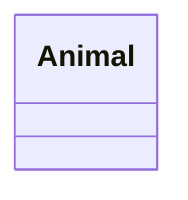
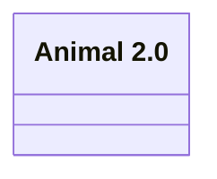
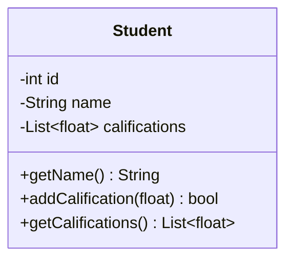
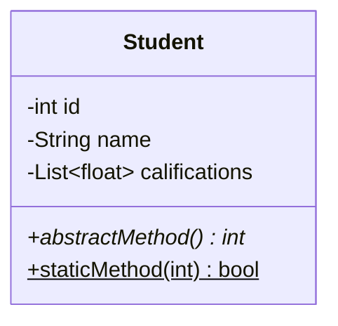
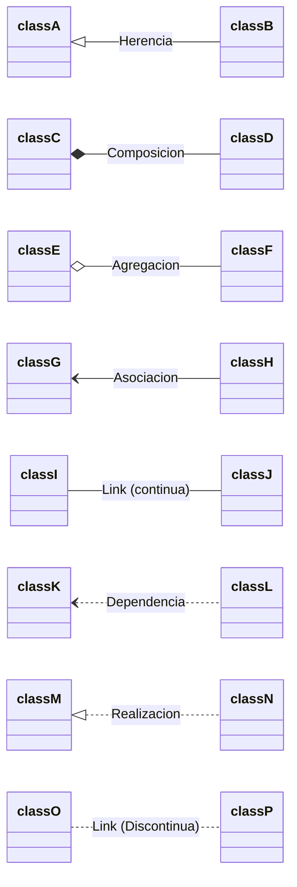
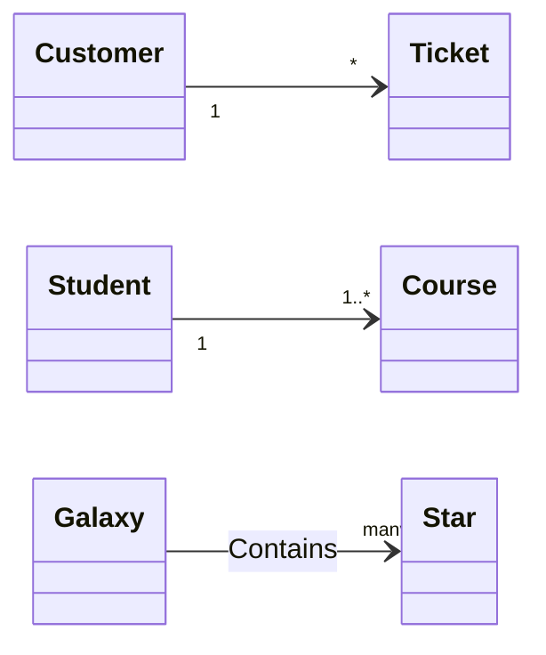
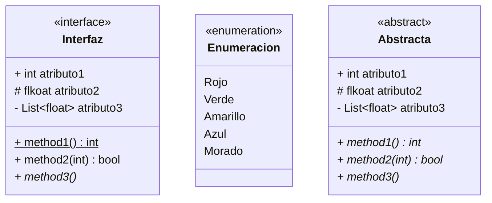

#  Diagamas de clase

## Sintaxis basica

Para crear diagramas de clase en *Markdown* se puede utilizar *mermaid* e insertaremos el diagrama como si fuese un codigo de lenguaje *mermaid*.

Comno estaremops usando mermaid tendremos que especificar que tipo de diagrama queremos que interprete, en este caso `classDiagram` en la primera linea.

En la sintaxis de *mermaid* para los diagramas de clase e distinguen tres parten principalmente. Una primera parte donde se define el nombre de la clase, una parte intermedia donde se describen los atributos de la clase y una ultima donde se especifican los metodos de la misma.

Para definir una clase haremos lo siguiente:

    ```mermaid
        classDiagram
        class Animal
    ```

Y el resultado seria una clase vacia:



Si se desea cambiar la etiqueta de la clase (el titulo visible en el diagrama) se puede emplear lo siguiente:

    ```mermaid
        classDiagram
        class Animal["Animal 2.0"]
    ```

Y el resultado seria el siguiente:



Vista la sintaxis para definir una clase, se debera aprender a definir los elementos internos de una clase, los atributos y los metodos principalmente.

Para completar la clase con su contenido abriremos { } despues del nombre de la clase e introduciremos lo siguiente:

    ```mermaid 
        classDiagram
        class BankAccount{
            +String owner
            +BigDecimal float
            +deposit(float) bool
            +withdrawal(float) int
        }
    ```

Se establece primeramente la visibilidad del atributo o metodo y despues el tipo de varible. En el caso de los metodos, entre parentesis introduciremos el tipo de variable de los parametros y despues el tipo de variable de la respuesta.

El resultado seria el siguiente:

 ```mermaid 
    classDiagram
    class BankAccount{

        +String owner
        +BigDecimal float

        +deposit(float) bool
        +withdrawal(float) int
    }
```

*Mermaid* posibilita tambien la definicion de variables genericas como `List<int>`. Para ello se hace uso del caracter especial ~ de la siguiente forma:

    ```mermaid
        classDiagram 
        class Student{

            -int id
            -String name
            -List~float~ califications
            
            +getName() String
            +addCalification(float) bool
            +getCalifications() List~float~
        }
    ```

Y el resultado seria el siguiente:



<br>

En caso e querer añadir algun metodo abstracto o estatico habra que añadir * o $, respectivamente, despues de la parentesis del metodo.

    ```mermaid
        classDiagram 
        class Student{

        -int id
        -String name
        -List~float~ califications

        +abstractMethod() int*
        +staticMethod(int) bool$
        }
    ```

Visualmente se veria de la siguiente manera:



<br>

## Relaciones entre clases

Para relacionar las clases con *mermaid* se juntaran los nombres de las dos clases que se quieren relacionar mediante una flecha. 

No obstante, com oen un diagrama UML puede haber diferentes tipos de relaciones se emplean diferentes tipos de flecha para cada una.

|Flecha|Tipo de relacion|
|:----:|:--------------:|
|<\|--|Herencia|
|*--|Composicion|
|o--|Agregacion|
|-->|Asociacion|
|--|Link (continua)|
|..>|Dependencia|
|..\|>|Realizacion|
|..|Link (discontinua)|

La relacion se decine de la siguiente manera: 

```markdown
[classA][Flecha][ClassB] : [Nombre relacion]
```


Aplicandolo a una clase real con *mermaid* seria asi:


    ```mermaid
        classDiagram
        direction LR
        classA <|-- classB : Herencia
        classC *-- classD : Composicion
        classE o-- classF : Agregacion
        classG <-- classH : Asociacion
        classI -- classJ : Link (continua)
        classK <.. classL : Dependencia
        classM <|.. classN : Realizacion
        classO .. classP: Link (Discontinua)
    ```



<br>

Para establecer la cardinalidad de las relaciones existen las siguientes opciones:

|Cardinalidad|Significado|
|:----------:|:---------:|
|1|Solo uno|
|0..1|Cero o uno|
|1..*|Uno o mas|
|*|Muchos|
|n|n|
|0..n|Desde cero hasta n|
|1..n|Desde uno hasta n|

<br>

Si se desea establecer la cardinalidad, a la hora de crear la relacion se debera de seguir el siguiente patron:

```markdown
[classA] [cardinalidad1] [Flecha] [cardinalidad2] [ClassB] : [Nombre relacion]
```

Aplicado a una clase quedaria algo de este tipo:

    ```mermaid
        classDiagram
        direction LR
            Customer "1" --> "*" Ticket
            Student "1" --> "1..*" Course
            Galaxy --> "many" Star : Contains
    ```



<br>

## Clases especiales

Habitualmente en la programacion orientada a objetos ademas de las clases corrientes existen tambine diferentes tipos de clases. Ejemplo de ello son las interfaces, las clases abstractas y/o las enumeraciones.

Mediante *mermaid* tambien se pueden definir la naturaleza de estas clases.

    ```mermaid
        classDiagram 
        direction LR

        class Interfaz{
            <<interface>>
            
            + int atributo1
            # flkoat atributo2
            - List~float~ atributo3

            + method1()$ int
            + method2(int) bool
            + method3()*
        }

        class Enumeracion{
            <<enumeration>>

            Rojo
            Verde 
            Amarillo
            Azul
            Morado
        }

        class Abstracta{
            <<abstract>>

            + int atributo1
            # flkoat atributo2
            - List~float~ atributo3

            + method1()* int
            + method2(int)* bool
            + method3()*
        }
    ```

    El resultado seria el siguiente:



Para mas informacion:

[MERMAID](https://mermaid.js.org/syntax/classDiagram.html#define-namespace)