# Diagramas en *Markdown*

*Markdown* permite crear diferentes tipos de diagramas a sus usuarios.

## Diagramas de flujo

Para crear diagramas de flujo en *Markdown* se puede utilizar *mermaid* e insertaremos el diagrama como si fuese un codigo de lenguaje *mermaid*.

Primeramente añadiremos el tipo de diagrama seguido de las letras `TB` que sirven para que el diagrama aparezca verticalmente. Si se desea que el diagrama aparezca en horizontal se utilizara `LR`

```markdown
```mermaid
flowchart TB
\```        (no usar \, es para escapar los caracteres)
```

Cada nodo se pondra en una linea, primero se pondra el identificador del nodo y despues el contenido textual del mismo envuelto en [ ]. Los caracteres especiales que envuelven el contenido del nodo dictaminan cual sera la forma de ese nodo. Existen las siguientes opciones:

<br>

Nodo de inicio/fin:

```markdown
A(Inicio)
```

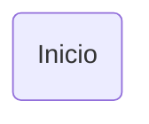

Nodo de proceso:

```markdown
A[Proceso]
```


Nodo de decision:

```markdown
A{Decision}
```

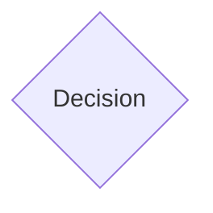

Nodo de entrada/salida:

```markdown
A[/Input/]
```

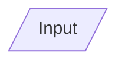

```markdown
A[\Output\]
```

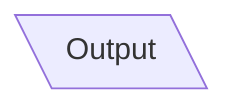

Nodo de subrutina:

```markdown
A[[Subrutina]]
```

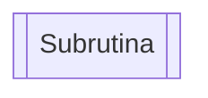

Nodo de base de datos:

```markdown
A[(DB)]
```

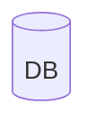

Una vez conocida la sintaxis de cada uno de los tipos de nodo, es importante saber como se unen entre si. Siguiendo la estructura de *mermaid* añadiremos la primera linea con el tipo de diagrama y `TB` seguido de todos los nodos. Despues se añadira lo siguiente para unir los nodos:

```markdown
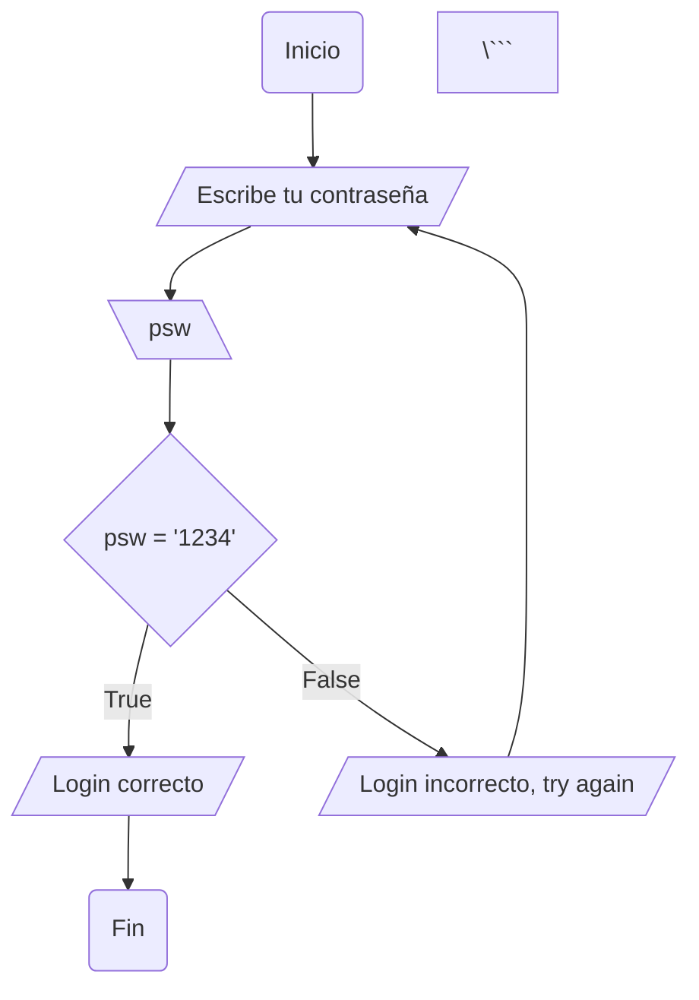

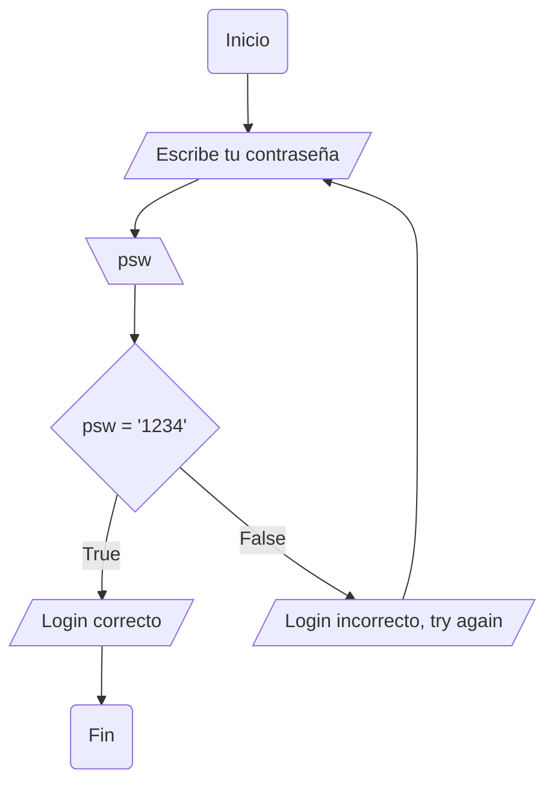

<br>

Si se desea añadir un titulo al diagrama se añadira lo siguiente en el codigo anterior:

```markdown
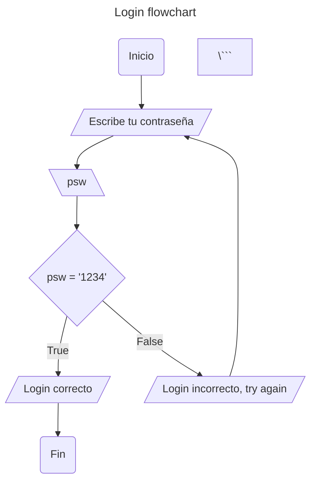

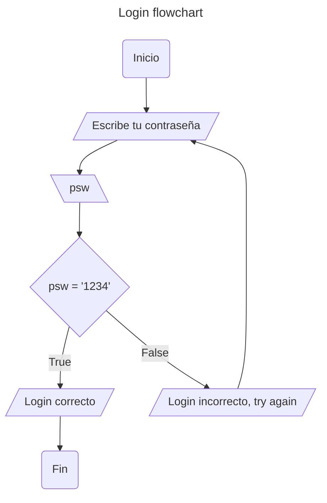

<br>

Si se quieren añadir lineas discontinuas se empleara la siguiente sintaxis:


```markdown
A-.->B
```

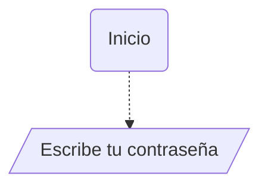


<br>

Por otra parte, si se desea añadir texto *Markdown* dentro se debe de encerrar entre "``"

```markdown
A("`Esto es **Texto** Markdown`")
```


<br>

Por ultimo, se pueden crear subgrafos dentro de un mismo diagrama de flujo. Para ello se emplea la siguiente estructura:

```markdown
```mermaid
flowchart TB
    
    A-->B
    subgraph Fase1
    B-->C
    C-->D
    D-->E
    end
    subgraph Fase2
    E-->F
    F-->G
    end
    subgraph Fase3
    G-->H
    H--I
    end
\```
```
El resultado seria el siguiente:

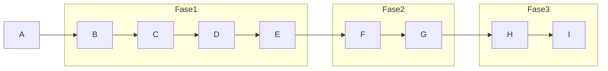

**PARA MAS INFORMACION:**

[Mermaid](https://mermaid.js.org/syntax/flowchart.html)


