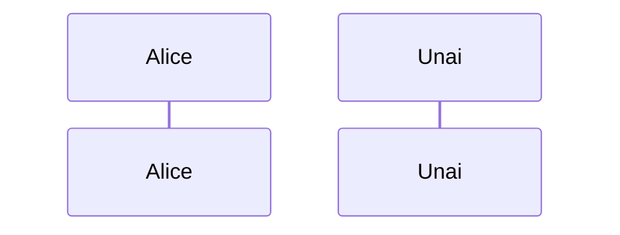
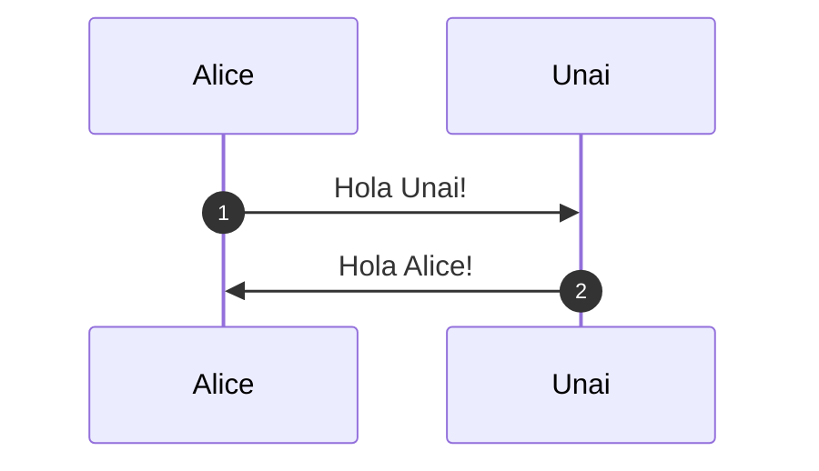
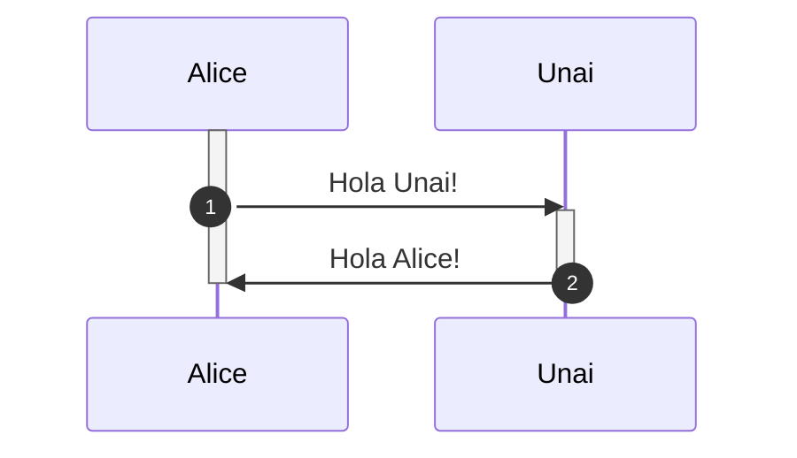
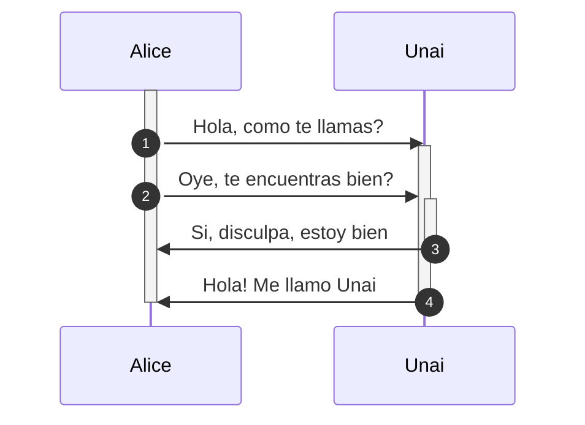
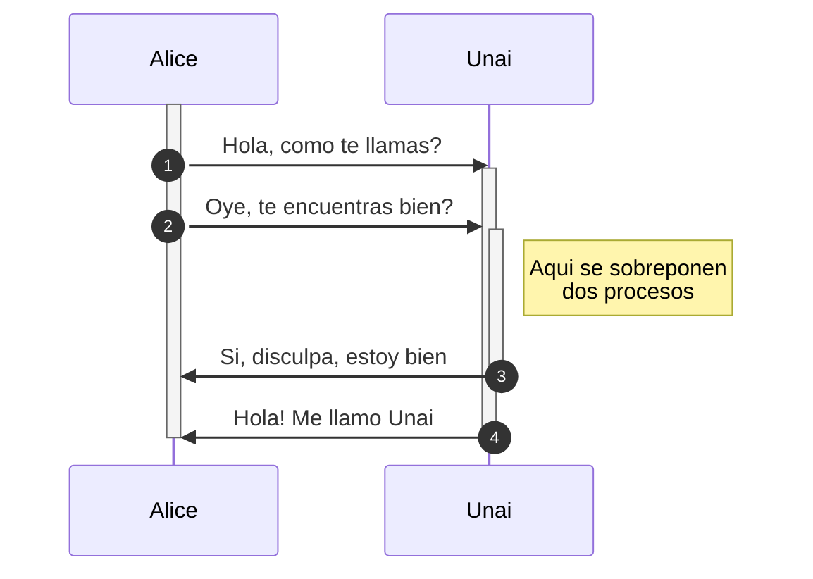
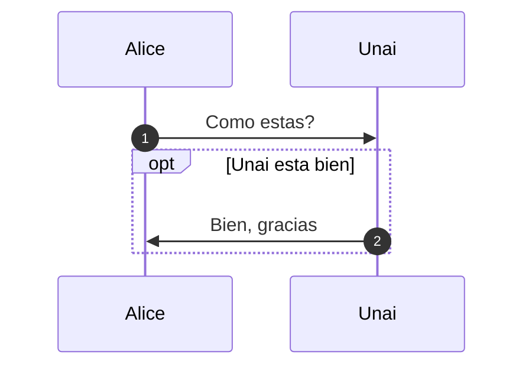
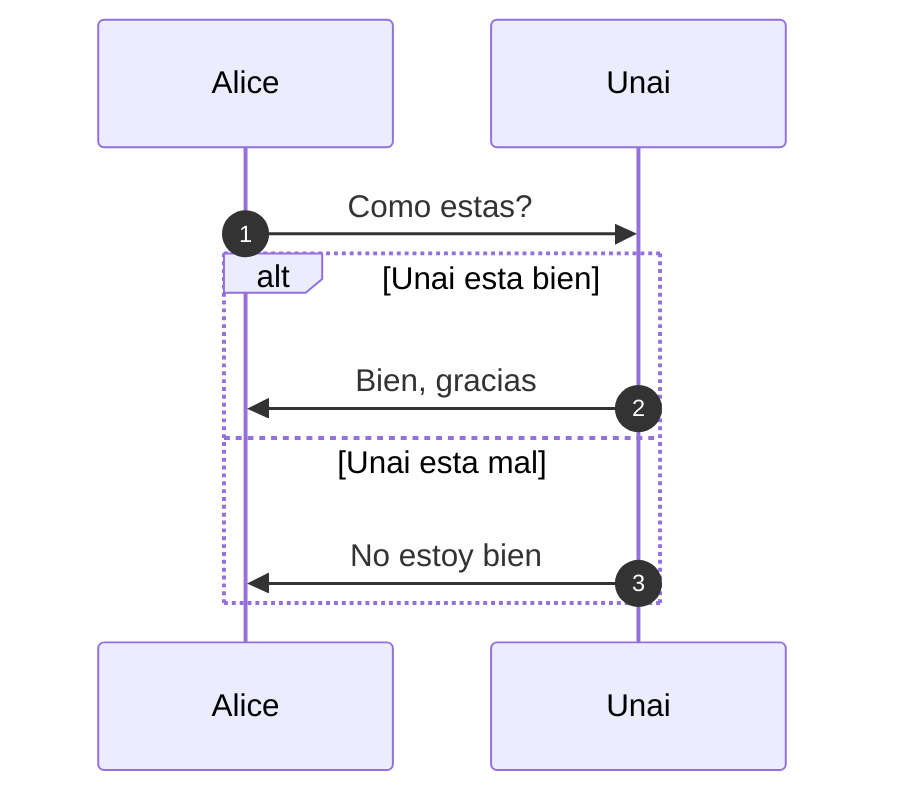

# Diagramas de secuencia 

## Sintaxis basica

Para crear diagramas de secuencia en *Markdown* se puede utilizar *mermaid* e insertaremos el diagrama como si fuese un codigo de lenguaje *mermaid*.

Como estaremos usando *mermaid* tendremos que especificar que tipo de diagrama queremos que interprete, en este caso `sequenceDiagram` en la primera linea.

Despues de definir el tipo de diagrama con el que vamos a trabajar, procedereos a definir los participantes del diagrama. Despues de definiran las interacciones entre los participantes añadidos.

<br>

### Definicion de los participantes

Para definir a los participantes se emplea la palabra reservada `participant` seguida del nombre del participante.

    ```mermaid 
        sequenceDiagram
        participant Alice
        participant Unai
    ```

El resultado seria el siguiente:



<br>

### Definicion de las interacciones

Uan vez definidos los actores, para añadir interacciones entre si, se empleara la siguiente estructura:

    [Emisor][Flecha][Receptor] : [Mensaje]

Como las flechas que se emplean pueden ser de diferentes tipos existe una expresion con caracteres especiales para cada una de ellas:

|Flecha|Descripcion|
|:----:|:---------:|
|->|Linea continua|
|-->|Linea discontinua|
|->>|Linea continua con flecha|
|-->>|Linea discontinua con flecha|
|-x|Linea continua con cruz|
|--x|Linea discontinua con cruz|
|-)|Linea continua con flecha abierta|
|--)|Linea discontinua con flecha abierta|

<br>

Para que las interacciones queden numeradas añadiremos la palabra reservada `autonumber`  en al siguiente linea a la que indica el tipo de diagrama.

Un ejemplo de diagrama de secuencia empleando lo explicado hasta ahora seria el siguiente:

    ```mermaid
        sequenceDiagram
        autonumber

        participant Alice
        participant Unai

        Alice ->> Unai : Hola Unai!
        Unai ->> Alice : Hola Alice!
    ```



<br>

### Activacion de los participantes

Para mostrar la ejecucion de los participantes a lo largo de el diagrama se emplean la palabras reservadas `activate` y `deactivate` seguidas del nombre del actor que se desea activar o desactivar. Estos comandos se activaran en el moemento que se defina.

    ```mermaid
            sequenceDiagram
            autonumber

            participant Alice
            participant Unai

            activate Alice
            Alice ->> Unai : Hola Unai!
            activate Unai
            Unai ->> Alice : Hola Alice!
            deactivate Unai
            deactivate Alice
    ```



<br>

Las activaciones se peuden anidar si alguno de los participantes ejecuta dos procesos al mismo tiempo. En este ejemplo se ve claramente:

    ```mermaid
            sequenceDiagram
            autonumber

            participant Alice
            participant Unai

            activate Alice
            Alice ->> Unai : Hola, como te llamas?
            activate Unai
            Alice ->> Unai : Oye, te encuentras bien?
            activate Unai
            Unai ->> Alice : Si, disculpa, estoy bien
            deactivate Unai
            Unai ->> Alice : Hola! Me llamo Unai
            deactivate Unai
            deactivate Alice
    ```



<br>

### Notas adjuntas

Mediante *mermaid* es posible añadir notas en el diagrama de secuencia empleando la siguiente sintaxis:

    Note [right of | left of | over][participants] : [Text]

Por ejemplo si en uno de los anteriores diagramas se añadiese alguna nota quedaria de esta forma:

    ```mermaid
            sequenceDiagram
            autonumber

            participant Alice
            participant Unai

            activate Alice
            Alice ->> Unai : Hola, como te llamas?
            activate Unai
            Alice ->> Unai : Oye, te encuentras bien?
            activate Unai
            Note right of Unai : Aqui se sobreponen <br> dos procesos
            Unai ->> Alice : Si, disculpa, estoy bien
            deactivate Unai
            Unai ->> Alice : Hola! Me llamo Unai
            deactivate Unai
            deactivate Alice
    ```




<br>

### Loops

La notacion para expresar bucles en *mermaid* es muy simple. Unicamente debemos de expresarlo como si de un lenguaje de programacion se tratase.

    ```mermaid
        sequenceDiagram
        autonumber

            Alice ->> Unai : Como estas?
            loop Cada minuto
                Unai ->> Alice : Bien, gracias
            end
    ```


<br>

### Condicionales

En el caso de los condiciones tambien es bastante simple, no obstante, se hace una distincion extra. 

En el caso de que el condicional no requiera `else` se utilizara la palabra reservada `opt` para construir el condicional.

    ```mermaid
        sequenceDiagram
        autonumber

        Alice ->> Unai : Como estas?
        opt Unai esta bien
            Unai ->> Alice : Bien, gracias
        end
    ```



En este ejemplo si Unai no estuviese bien no contestaria nada. Si se qiere que Unai conteste tambien cuando esta mal utilizaremos la segunda forma, empleando las palabras reservadas `alt` y `else`.


    ```mermaid
        sequenceDiagram
        autonumber

        Alice ->> Unai : Como estas?
        alt Unai esta bien
            Unai ->> Alice : Bien, gracias
        else Unai esta mal
            Unai ->> Alice : No estoy bien
        end



Mas informacion:

[MERMAID](https://mermaid.js.org/syntax/sequenceDiagram.html#syntax)
