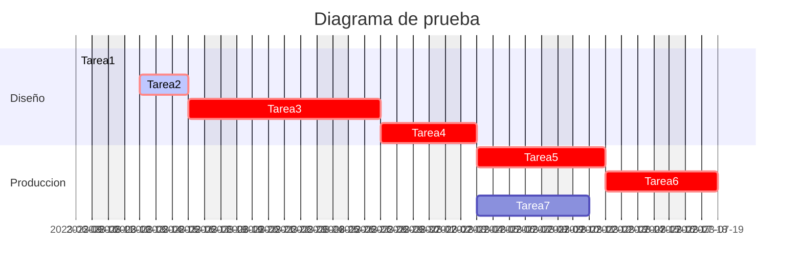

# Diagrama de Gantt

## Sintaxis basica

Como en todos los casos en los que usamos *mermaid* primeramente deberemos especificar el tipo de diagrama con el que vamos a trabajar, que en esta ocasion se añadira la palabra reservada `gantt` en la primera linea.

Seguido de ello añadiremos las cabeceras del diagrama que vamos a crear. En ellas quedara especificado el formato de las fechas, el titulo, si algun dia de la semana se debe excluir y la escala temporal del diagrama.

    ```mermaid
        gantt
        dateFormat YYYY-MM-DD
        title Diagrama de prueba
        tickInterval 1day
        excludes weekends %%Se puede poner nombres de dias o fechas concretas
    ```

Despues de definir las cabeceras pasaremos a definir las diferentes tareas que incluira el diagrama. Para dejar las tareas ordenadas por departamentos se pueden divdir mediante la palabra reservada `section`.

Despues se añadira el nombre de la tarea seguido de dos puntos. Cada tarea ocupara una linea para mantener el codigo ordenado. A continuacio nde los dos puntos añadiremos `done` si la tarea esta terminada, `active` si la tarea esta en marcha o nada si la tarea aun no se ha empezado. Separado por comas despues añadiremos, el `id` de la tarea, la fecha de inicio (o despues de que tarea comienza) y la fecha de fin (o la duracion de la tarea).

Por ultimo, en las tareas que conformen el camino critico añadiremos `crit` en las caracteristicas de la tarea.

    ```mermaid
    gantt
        dateFormat YY-MM-DD
        title Diagrama de prueba
        excludes weekends
        tickInterval 1day

        section Diseño
        Tarea1:     crit, done, id1, 2023-06-09,2023-06-12
        Tarea2:     crit, active, id2, 2023-06-13, 3d
        Tarea3:     crit, id3, after id2, 8d
        Tarea4:     crit, id4, after id3, 4d

        section Produccion
        Tarea5:     crit, id5, after id4, 6d  
        Tarea6:     crit, id6, after id5, 5d
        Tarea7:     id7, after id4, 5d
    ```




**PARA MAS INFORMACION:**

[MERMAID](https://mermaid.js.org/syntax/gantt.html#a-note-to-users)
